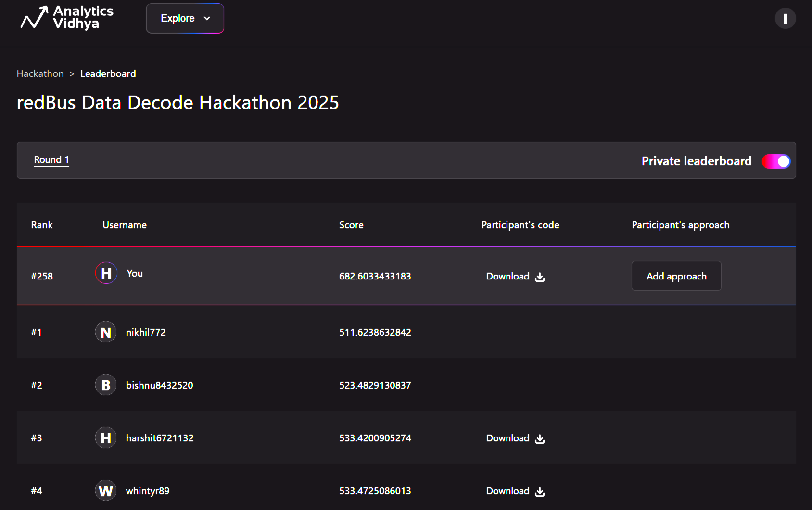

# 🚌Bus Demand Forecasting Model

## 🚀 Problem Statement
The goal is to forecast bus seat demand at the route level exactly **15 days before the date of journey (doj)**. Demand patterns depend on a complex mix of factors like holidays, weekends, regional events and seasonality. This task is formulated as a **tabular time-series regression problem**.

---

## 📊 Objective
Predict `final_seatcount` (total booked seats) for each (`srcid`, `destid`, `doj`) using all data available till 15 days before the journey.

---

## 📁 Dataset Description

| File            | Description                                              |
|-----------------|----------------------------------------------------------|
|  train.csv      | Historical booking data with `final_seatcount`.          |
|  test.csv       | Unlabeled data for which predictions are required.       |
|  transactions.csv  | Detailed search & booking transactions including `doi` (date of issue), used to derive features like `dbd = doj - doi`. |

Each transaction includes:
- `srcid`, `destid`, `doj`, `doi`
- `searchcount`, `seatcount`
- Region and tier information

---

## 🛠️ Feature Engineering Highlights

- **Time-Based Features** - `dayofweek`, `week`, `month`, `is_weekend`
- **Lag and Rolling Statistics** -
  - `cumsum_seatcount`, `cumsum_searchcount` till `dbd = 15`
  - `lag1`, `rolling_mean3`, `rolling_std3` per route
- **Grouped Aggregations** -
  - Aggregates by `srcid`, `destid`, `srcid_destid`, `srcid_week`, `destid_month`
- **Categorical Encodings** -
  - Label Encoding for region and tier features

---

## 🤖 Model Architecture

| Component       | Details                                                   |
|----------------|-----------------------------------------------------------|
| Model Types     | LightGBM, XGBoost, CatBoost, TabNet (proxy for TABDPT)    |
| Ensembling      | Averaging predictions across models and feature subsets   |
| Validation      | Time-based holdout (train: before Nov 1, val: Nov onwards) |
| Optimization    | Optuna for hyperparameter tuning (LightGBM)               |
| Metric          | RMSE (Root Mean Squared Error)                            |

---

## 📈 Performance Summary

- **Best Validation RMSE** - ~804.37
- **Tabular ensemble** improved generalization by combining -
  - LightGBM (Optuna-tuned)
  - XGBoost
  - CatBoost
  - TabNet (Tabular Deep Prompt Tuning proxy)
- **Data leakage** avoided using proper date filtering (`dbd < 15`) and validation split

---

## 📦 Tech Stack

- Python (pandas, numpy, sklearn)
- LightGBM / XGBoost / CatBoost
- Optuna (hyperparameter tuning)
- TabNet (`pytorch-tabnet`)
- Matplotlib, Seaborn (for EDA)

---

## 🏁 Leaderboard Rank

Achieved **Rank #258** out of 8500+ participants with a score of **682.60334**

